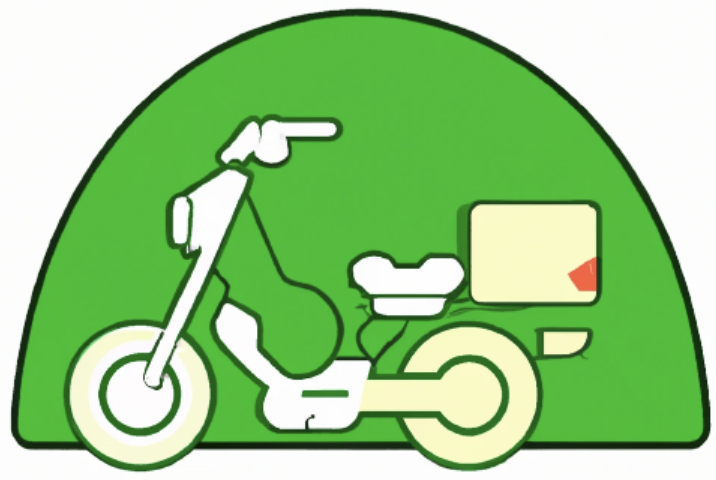

  

# Pedilo Ahora

Hemos sido contratados por una empresa local que quiere crear una app que permita a los usuarios hacer pedidos de comida
a domicilio. En este contexto se no pide que creemos una aplicación que permita dar de alta a los restaurantes con 
sus locales y la comida que ofrecen, y que los usuarios puedan hacer pedidos a los mismos.
La empresa ya tiene una base de datos con la lista de los barrios de la ciudad donde va a operar la app y nos ha 
entregado una lista de categorías de comida que se pueden ofrecer. Los menues que ofrecen los restaurantes deben
tener un tiempo de preparación estimado y estar asociados a una categoría.

## Requerimientos Funcionales

- **RF1**: El sistema debe permitir a los restaurantes registrarse en la plataforma.
  - Debe requerir los siguientes datos:
    - Nombre del restaurante (Debe ser único).
    - Nickname (Debe ser único).
    - Email (Debe ser único y tener un formato valido).
    - Contraseña (Debe tener al menos 8 caracteres de los cuales al menos uno debe ser un número).
- **RF2**: El sistema debe permitir a los restaurantes dar de alta locales.
  - Debe requerir los siguientes datos:
    - Nombre del local.
    - Barrio en el que opera el local (Debe ser un barrio de la lista que se nos entregó).
    - Horario de atención.
    - Cantidad máxima de pedidos que puede recibir al mismo tiempo (Debe ser un número entero mayor a 0).
- **RF3**: El sistema debe permitir a los restaurantes dar de alta comida.
  - Debe requerir los siguientes datos:
    - Nombre del menú.
    - Precio del menú (Debe ser un número decimal mayor a 0)
    - Tiempo de preparación expresado en minutos (Debe ser un número entero mayor a 0)
    - Categoría del menú (Debe ser una categoría de comida de la lista que se nos entregó).
  - Se asume que todos los menus estan disponibles en todos los locales del restaurante.
- **RF4**: El sistema debe permitir a los usuarios registrarse en la plataforma.
  - Debe requerir los siguientes datos:
    - Nombre.
    - Apellido.
    - Nickname (Debe ser único).
    - Barrio en el que vive (Debe ser un barrio de la lista que se nos entregó).
    - Nivel de usuario (Debe ser un número entero entre 1 y 5).
- **RF5**: El sistema debe permitir a los usuarios buscar restaurantes por barrio.
- **RF6**: El sistema debe permitir a los usuarios buscar los productos de un restaurante.
- **RF7**: El sistema debe permitir a los usuarios buscar los productos de un restaurante por categoría.
- **RF8**: El sistema debe permitir a los usuarios hacer pedidos.
  - Debe requerir los siguientes datos:
    - Usuario que hace el pedido.
    - Restaurante y local al que se le hace el pedido.
    - Productos que se piden.
    - Fecha y hora deseada de entrega.
  - El sistema debe calcular el costo del pedido en base a los productos pedidos, costo del servicio y el costo de envío.
    - El costo del servicio es de 100 pesos para niveles del 1 y 2, 50 pesos para niveles 3 y 4 y 0 pesos para nivel 5.
    - El costo de envío es de 200 pesos para horarios pico y 100 pesos para el resto de los horarios (Los horarios pico
son de las 12:00 a las 14:00 y de las 20:00 a las 22:00).
    - El costo de los productos es la suma de los precios de los productos pedidos.
  - El horario estimado de entrega se calcula sumando al horario de la orden 15 minutos mas al horario del producto 
que mas demora en prepararse.
    - Por ejemplo, si la orden es para las 20:00 y el producto que mas demora en prepararse tiene un tiempo de 
preparación de 30 minutos, el horario estimado de entrega es las 20:45.
  - Si el local alcanzó el máximo de pedidos que puede recibir al mismo tiempo, el sistema debe rechazar el pedido.
  - Si el local no opera en el barrio del usuario, el sistema debe rechazar el pedido.
  - Si el local no atiene en el horario deseado, el sistema debe rechazar el pedido.

## Requerimientos No Funcionales

- **RNF1**: El sistema debe estar desarrollado con Java 17, Maven y Spring Boot.
- **RNF2**: El sistema debe tener una base de datos H2.
- **RNF3**: El sistema debe tener al menos un 80% de cobertura de test unitarios con JUnit.
- **RNF4**: El sistema debe tener una interfaz REST.
  - Debe respetar los siguientes contratos:

    | Requerimiento | Método     | Ruta                                                        | Descripción |
    |---------------|------------|-------------------------------------------------------------| ----------- |
    | **RF1**       | POST       | /restaurantes                                               | Da de alta un restaurante. |
    | **RF2**       | POST       | /restaurantes/{idRestaurante}/locales                       | Da de alta un local. |
    | **RF3**       | POST       | /restaurantes/{idRestaurante}/locales/{idLocal}/menus       | Da de alta un menú. |
    | **RF4**       | POST       | /usuarios                                                   | Da de alta un usuario. |
    | **RF5**       | GET        | /restaurantes?barrio={barrio}                               | Busca restaurantes por barrio.                        |
    | **RF6**       | GET        | /restaurantes/{idRestaurante}/menus                         | Busca los productos de un restaurante.                |
    | **RF7**       | GET        | /restaurantes/{idRestaurante}/menus?categoria={idCategoria} | Busca los productos de un restaurante por categoría.  |
    | **RF8**       | POST       | /pedidos                                                    | Hace un pedido.                                       |

## Metodo de evaluación

El proyecto se evaluará ejecutando las apis desde postman y validando que cumplan con los requerimientos funcionales 
y no funcionales. Adicionalmente se contemplará la cobertura de test unitarios y la calidad del código.

| Requerimiento | Puntos | Criterio                                                                                    |
|-----|------|---------------------------------------------------------------------------------------------|
| RF1 | 5    | Funcionando con todas las validaciones.                                                     |
| RF2 | 5    | Funcionando con todas las validaciones.                                                     |
| RF3 | 5    | Funcionando con todas las validaciones.                                                     |
| RF4 | 5    | Funcionando con todas las validaciones.                                                     |
| RF5 | 5    | Funcionando y contrato correcto.                                                            |
| RF6 | 5    | Funcionando y contrato correcto.                                                            |
| RF7 | 5    | Funcionando y contrato correcto.                                                            |
| RF8 | 35   | 10 puntos por calculos montos / 15 puntos por calculo entrega / 10 por rechazos             |
| RNF3 | 30   | Porcentaje sobre la cobertura requerida (Ej. cobertura del 40% = 50% de lo requerido -> 15 puntos. |
| **Total** | 100  | Sumtoria de cada punto.                                                                     |
